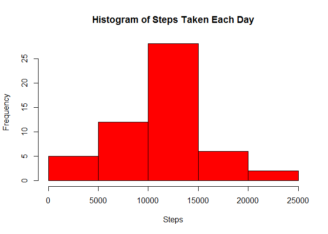
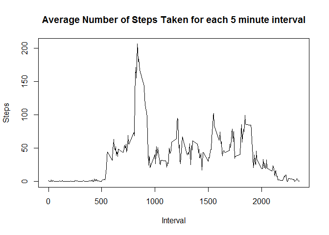
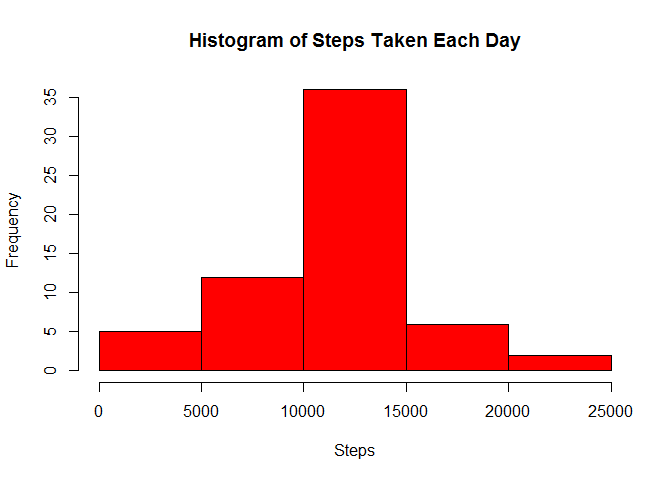

# Reproducible Research: Peer Assessment 1


## Loading and preprocessing the data

```r
activity <- read.csv("activity.csv")
activity[,1] <- as.numeric(activity[ ,1])
activity[,2] <- as.Date(activity[ ,2], format="%Y-%m-%d")
activity[,3] <- as.numeric(activity[ ,3])
```

## What is mean total number of steps taken per day?
1. Calculate the number of steps taken per day.

```r
## Subset data to exclude missing values
na_log <- is.na(activity[,1])
activity_sub <- activity[!na_log, ]

## Sum number of steps per day
day_sum <- tapply(activity_sub$steps, activity_sub$date, sum)
```

2. Make a histogram of total number of steps taken each day

```r
hist(day_sum, col="red", main="Histogram of Steps Taken Each Day", xlab="Steps")
```

 

3. Calculate and report the mean and median number of steps taken per day

```r
day_sum_mean <- format(mean(day_sum), scientific = FALSE)
day_sum_median <- format(median(day_sum), scientific = FALSE)
```

The mean number of steps taken per day is 10766.19 and the median number of steps taken per day is 10765.

## What is the average daily activity pattern?

```r
## Calculate the mean number of steps taken during each interval and plot
interval_mean <- aggregate(activity_sub$steps, list(interval=activity_sub$interval), mean)
plot(interval_mean$interval, interval_mean$x, type ="l", xlab="Interval", ylab="Steps", main="Average Number of Steps Taken for each 5 minute interval")
```

 

```r
## Determine the interval with the highest mean number of steps taken
interval_max <- interval_mean$interval[interval_mean$x==max(interval_mean$x)]
```

The 5 minute interval that contains the highest number of steps on average across all days is 835.

## Imputing missing values

```r
na_row <- nrow(activity[is.na(activity$steps), ])
```

There are 2304 number of missing values in the dataset.

Each NA value will be replaced with the average number of steps for that interval taken across all days.


```r
## Create a new dataset with NA values filled in
activity_filled <- activity
for (i in 1:nrow(activity_filled)) {
     if (is.na(activity_filled[i,1])) {
          activity_filled[i,1] <- interval_mean$x[interval_mean$interval==activity_filled[i,3]]
     }
}

## Make a new histogram of the total number of steps taken each day
day_sum_filled <- tapply(activity_filled$steps, activity_filled$date, sum)
hist(day_sum_filled, col="red", main="Histogram of Steps Taken Each Day", xlab="Steps")
```

 

```r
## Calculate the new mean and median
day_sum_filled_mean <- format(mean(day_sum_filled), scientific = FALSE)
day_sum_filled_median <- format(median(day_sum_filled), scientific = FALSE)
```

The new mean number of steps taken per day is 10766.19 and the new median number of steps taken per day is 10766.19.  When compared to the original mean of 10766.19 and original median of 10765, the mean did not change but the median did.  The difference between the two means and medians is fairly minimal.

## Are there differences in activity patterns between weekdays and weekends?
1. Create a new factor variable in the dataset with two levels - "weekday" and "weekend" indicating whether a given date is a weekday or weekend day


```r
activity_filled$weekday <- weekdays(activity_filled[,2])
for (i in 1:nrow(activity_filled)) {
     if (activity_filled$weekday[i] == "Saturday") {activity_filled$weekday[i] <- "weekend"}
     else if (activity_filled$weekday[i] == "Sunday") {activity_filled$weekday[i] <- "weekend"}
     else {activity_filled$weekday[i] <- "weekday"}
}
activity_filled$weekday <- as.factor(activity_filled$weekday)
```

2. Make a panel plot containing a time series plot of the 5-minute interval and the average number of steps taken, averaged across all weekday days or weekend days


```r
## Compute the average number of steps taken per 5 minute interval for weekdays and weekends
### Subset all weekday rows and all weekend rows
activity_wkday <- activity_filled[activity_filled$weekday == "weekday", ]
activity_wkend <- activity_filled[activity_filled$weekday == "weekend", ]

### Calculate the mean of each interval for weekdays and weekends
interval_mean_wkday <- aggregate(list(steps=activity_wkday$steps), list(interval=activity_wkday$interval), mean)
interval_mean_wkend <- aggregate(list(steps=activity_wkend$steps), list(interval=activity_wkend$interval), mean)

### Combine weekday and weekend interval means into one data frame with a weekday factor variable
interval_mean_wkday$weekday <- as.factor("weekday")
interval_mean_wkend$weekday <- as.factor("weekend")
interval_mean_new <- rbind(interval_mean_wkday, interval_mean_wkend)

## Plot the data
library(lattice)
with(interval_mean_new, {xyplot(steps ~ interval | weekday, layout = c(1,2), type = "l")})
```

 
